# Game Architecture

This document contains the architectural overview of the Sword game, showing the major components and their relationships.

## Architecture Diagram

```mermaid
graph TB
    %% Main Application Layer
    subgraph "Application Layer"
        Main[main.go<br/>Entry Point]
        Game[Game Struct<br/>Implements ebiten.Game]
    end

    %% Engine Core Systems
    subgraph "Engine Core"
        StateManager[StateManager<br/>State Management]
        Config[Config System<br/>Game Settings]
        Logger[Logger<br/>Logging System]
        Camera[Camera<br/>Viewport Management]
        SpriteManager[SpriteManager<br/>Sprite Loading]
        HUDManager[HUDManager<br/>UI Components]
        DebugHUD[DebugHUD<br/>Debug Interface]
        ParallaxRenderer[ParallaxRenderer<br/>Background Layers]
        ViewportRenderer[ViewportRenderer<br/>Viewport Frame]
        PlaceholderSprites[PlaceholderSprites<br/>Dev Sprites]
    end

    %% Game Systems (ECS-like)
    subgraph "Game Systems"
        GameSystemManager[GameSystemManager<br/>System Orchestration]
        InputSystem[InputSystem<br/>Input Handling]
        PhysicsSystem[PhysicsSystem<br/>Physics & Collision]
        CameraSystem[CameraSystem<br/>Camera Control]
        RoomSystem[RoomSystem<br/>Room Management]
    end

    %% Game States
    subgraph "Game States"
        StartState[StartState<br/>Main Menu]
        InGameState[InGameState<br/>Gameplay Loop]
        PauseState[PauseState<br/>Game Paused]
        SettingsState[SettingsState<br/>Configuration]
        TileDebugState[TileDebugState<br/>Level Editor]
    end

    %% World System
    subgraph "World System"
        WorldMap[WorldMap<br/>Room Discovery & Navigation]
        Room[Room Interface<br/>Level Abstraction]
        TiledRoom[TiledRoom<br/>Tile-based Levels]
        TileMap[TileMap<br/>2D Tile Grid]
        RoomTransitionManager[RoomTransitionManager<br/>Room Transitions]
        Minimap[MiniMapRenderer<br/>Navigation Aid]
    end

    %% Entity System
    subgraph "Entity System"
        Player[Player<br/>Main Character]
        PlayerCollision[PlayerCollision<br/>Physics & Collision]
        BaseEnemy[BaseEnemy<br/>Enemy Base Class]
        SlimeEnemy[SlimeEnemy<br/>Slime Enemy Type]
        WandererEnemy[WandererEnemy<br/>Wanderer Enemy Type]
        EnemyInterface[Enemy Interface<br/>Common Enemy Behavior]
        TileProvider[TileProvider Interface<br/>Collision Detection]
    end

    %% Resource Management
    subgraph "Resources"
        Images[Image Resources<br/>Sprites & Textures]
        Platformer[Platformer Assets<br/>Character Sprites]
        ForestTiles[Forest Tiles<br/>Environment Sprites]
        RoomLayouts[Room Layouts<br/>Level Definitions]
    end

    %% External Dependencies
    subgraph "External"
        Ebiten[Ebitengine<br/>Game Engine]
        Go[Go Runtime<br/>Language Runtime]
    end

    %% Main flow connections
    Main --> Game
    Game --> StateManager
    StateManager --> StartState
    StateManager --> InGameState
    StateManager --> PauseState
    StateManager --> SettingsState
    StateManager --> TileDebugState

    %% Engine connections
    Game --> Config
    Game --> Logger
    InGameState --> Camera
    InGameState --> HUDManager
    InGameState --> ViewportRenderer
    HUDManager --> DebugHUD
    HUDManager --> Minimap
    TiledRoom --> ParallaxRenderer
    StateManager --> SpriteManager
    SpriteManager --> PlaceholderSprites

    %% Game System connections
    InGameState --> GameSystemManager
    GameSystemManager --> InputSystem
    GameSystemManager --> PhysicsSystem
    GameSystemManager --> CameraSystem
    GameSystemManager --> RoomSystem
    InputSystem --> Player
    PhysicsSystem --> Player
    PhysicsSystem --> Room
    CameraSystem --> Camera
    CameraSystem --> Player
    RoomSystem --> RoomTransitionManager

    %% World system connections
    InGameState --> WorldMap
    InGameState --> RoomTransitionManager
    RoomTransitionManager --> Room
    Room --> TiledRoom
    TiledRoom --> TileMap
    TiledRoom --> TileProvider
    WorldMap --> Minimap

    %% Entity system connections
    InGameState --> Player
    InGameState --> BaseEnemy
    Player --> PlayerCollision
    PlayerCollision --> TileProvider
    BaseEnemy --> EnemyInterface
    SlimeEnemy --> EnemyInterface
    WandererEnemy --> EnemyInterface
    BaseEnemy --> SlimeEnemy
    BaseEnemy --> WandererEnemy

    %% Resource connections
    SpriteManager --> Images
    Images --> Platformer
    Images --> ForestTiles

    %% External dependencies
    Game --> Ebiten
    Main --> Go

    %% Styling
    classDef core fill:#e1f5fe
    classDef state fill:#f3e5f5
    classDef world fill:#e8f5e8
    classDef entity fill:#fff3e0
    classDef resource fill:#fce4ec
    classDef external fill:#f5f5f5
    classDef systems fill:#fff9c4

    class StateManager,Config,Logger,Camera,SpriteManager,HUDManager,DebugHUD,ParallaxRenderer,ViewportRenderer,PlaceholderSprites core
    class StartState,InGameState,PauseState,SettingsState,TileDebugState state
    class WorldMap,Room,TiledRoom,TileMap,RoomTransitionManager,Minimap world
    class Player,PlayerCollision,BaseEnemy,SlimeEnemy,WandererEnemy,EnemyInterface,TileProvider entity
    class Images,Platformer,ForestTiles,RoomLayouts resource
    class Ebiten,Go external
    class GameSystemManager,InputSystem,PhysicsSystem,CameraSystem,RoomSystem systems
```

## Component Descriptions

### Application Layer
- **main.go**: Entry point that initializes the game, sets up signal handling, and starts the game loop
- **Game Struct**: Implements ebiten.Game interface, manages the main game loop (Update/Draw/Layout)

### Engine Core
- **StateManager**: Manages game state transitions and delegates update/draw calls to current state
- **Config System**: Handles game configuration, window settings, and player physics parameters
- **Logger**: Provides structured logging with file output, log levels, and validation warnings
- **Camera**: Manages viewport positioning, following player movement, and world-to-screen transformations
- **SpriteManager**: Loads and manages sprite sheets with tile extraction capabilities
- **HUDManager**: Coordinates all UI components and delegates rendering
- **DebugHUD**: Provides real-time debugging information overlay
- **ParallaxRenderer**: Handles multi-layer background rendering with parallax scrolling
- **ViewportRenderer**: Manages viewport frame rendering and black borders
- **PlaceholderSprites**: Generates placeholder sprites for development and testing

### Game Systems
- **GameSystemManager**: Orchestrates all game systems and manages their update order
- **InputSystem**: Handles player input, pause/settings requests, and debug key bindings
- **PhysicsSystem**: Updates physics for all entities and handles collision detection
- **CameraSystem**: Controls camera following and viewport updates
- **RoomSystem**: Manages room transitions and notifies other systems of room changes

### Game States
- **StartState**: Main menu and initial game state
- **InGameState**: Core gameplay loop with player movement, physics, and world interaction
- **PauseState**: Paused game state with resume/quit options
- **SettingsState**: Configuration menu for game settings with tabbed interface
- **TileDebugState**: Tile viewer and debugging tool for level design

### World System
- **WorldMap**: Manages room discovery, connectivity, and minimap data
- **Room Interface**: Abstract interface for different room implementations
- **TiledRoom**: Concrete room implementation using tile-based levels
- **TileMap**: 2D grid of tiles with collision and rendering data
- **RoomTransitionManager**: Handles room transitions, spawn points, and player positioning
- **MiniMapRenderer**: HUD component that displays discovered rooms and player location

### Entity System
- **Player**: Main character with movement, jumping, and physics
- **PlayerCollision**: Handles player-specific collision detection and response
- **BaseEnemy**: Base class for all enemy types with common behavior
- **SlimeEnemy**: Slime enemy with patrol behavior
- **WandererEnemy**: Wandering enemy with random movement
- **Enemy Interface**: Common interface for all enemy types
- **TileProvider Interface**: Interface for entities that need tile collision detection

### Resource Management
- **Image Resources**: Central repository for all game sprites and textures
- **Platformer Assets**: Character sprites and animations
- **Forest Tiles**: Environment tileset for forest-themed levels
- **Room Layouts**: JSON definitions for room layouts and configurations

### External Dependencies
- **Ebitengine**: 2D game engine providing rendering, input, and audio
- **Go Runtime**: Language runtime and standard library

## Key Architectural Patterns

1. **State Pattern**: Game states manage different modes of gameplay
2. **System Architecture**: Game systems handle specific aspects of game logic
3. **Interface-based Design**: Rooms, enemies, and HUD components use interfaces for flexibility
4. **Component Separation**: Clear separation between rendering, physics, and game logic
5. **Resource Management**: Centralized sprite and asset management
6. **Logging Infrastructure**: Comprehensive logging with multiple categories and validation

---

*Last Updated: $(date)*
*This diagram should be updated when major architectural changes are made to the codebase.*