# Game Architecture

This document contains the architectural overview of the Sword game, showing the major components and their relationships.

## Architecture Diagram

```mermaid
graph TB
    %% Main Application Layer
    subgraph "Application Layer"
        Main[main.go<br/>Entry Point]
        Game[Game Struct<br/>Implements ebiten.Game]
    end

    %% Engine Core Systems
    subgraph "Engine Core"
        StateManager[StateManager<br/>State Management]
        Config[Config System<br/>Game Settings]
        Logger[Logger<br/>Logging System]
        Camera[Camera<br/>Viewport Management]
        SpriteManager[SpriteManager<br/>Sprite Loading]
        HUDManager[HUDManager<br/>UI Components]
        DebugHUD[DebugHUD<br/>Debug Interface]
        ParallaxRenderer[ParallaxRenderer<br/>Background Layers]
    end

    %% Game States
    subgraph "Game States"
        StartState[StartState<br/>Main Menu]
        InGameState[InGameState<br/>Gameplay Loop]
        PauseState[PauseState<br/>Game Paused]
        SettingsState[SettingsState<br/>Configuration]
        TileDebugState[TileDebugState<br/>Level Editor]
    end

    %% World System
    subgraph "World System"
        WorldMap[WorldMap<br/>Room Discovery & Navigation]
        Room[Room Interface<br/>Level Abstraction]
        SimpleRoom[SimpleRoom<br/>Tile-based Levels]
        TileMap[TileMap<br/>2D Tile Grid]
        Minimap[Minimap<br/>Navigation Aid]
    end

    %% Entity System
    subgraph "Entity System"
        Player[Player<br/>Main Character]
        PlayerCollision[PlayerCollision<br/>Physics & Collision]
        BaseEnemy[BaseEnemy<br/>Enemy Base Class]
        SlimeEnemy[SlimeEnemy<br/>Slime Enemy Type]
        WandererEnemy[WandererEnemy<br/>Wanderer Enemy Type]
        EnemyInterface[Enemy Interface<br/>Common Enemy Behavior]
    end

    %% Resource Management
    subgraph "Resources"
        Images[Image Resources<br/>Sprites & Textures]
        Platformer[Platformer Assets<br/>Character Sprites]
        ForestTiles[Forest Tiles<br/>Environment Sprites]
        RoomLayouts[Room Layouts<br/>Level Definitions]
    end

    %% External Dependencies
    subgraph "External"
        Ebiten[Ebitengine<br/>Game Engine]
        Go[Go Runtime<br/>Language Runtime]
    end

    %% Main flow connections
    Main --> Game
    Game --> StateManager
    StateManager --> StartState
    StateManager --> InGameState
    StateManager --> PauseState
    StateManager --> SettingsState
    StateManager --> TileDebugState

    %% Engine connections
    Game --> Config
    Game --> Logger
    InGameState --> Camera
    InGameState --> HUDManager
    InGameState --> DebugHUD
    InGameState --> ParallaxRenderer
    StateManager --> SpriteManager

    %% World system connections
    InGameState --> WorldMap
    InGameState --> Room
    Room --> SimpleRoom
    SimpleRoom --> TileMap
    WorldMap --> Minimap

    %% Entity system connections
    InGameState --> Player
    InGameState --> BaseEnemy
    Player --> PlayerCollision
    BaseEnemy --> EnemyInterface
    SlimeEnemy --> EnemyInterface
    WandererEnemy --> EnemyInterface
    BaseEnemy --> SlimeEnemy
    BaseEnemy --> WandererEnemy

    %% Resource connections
    SpriteManager --> Images
    Images --> Platformer
    Images --> ForestTiles
    SimpleRoom --> RoomLayouts

    %% External dependencies
    Game --> Ebiten
    Main --> Go

    %% Styling
    classDef core fill:#e1f5fe
    classDef state fill:#f3e5f5
    classDef world fill:#e8f5e8
    classDef entity fill:#fff3e0
    classDef resource fill:#fce4ec
    classDef external fill:#f5f5f5

    class StateManager,Config,Logger,Camera,SpriteManager,HUDManager,DebugHUD,ParallaxRenderer core
    class StartState,InGameState,PauseState,SettingsState,TileDebugState state
    class WorldMap,Room,SimpleRoom,TileMap,Minimap world
    class Player,PlayerCollision,BaseEnemy,SlimeEnemy,WandererEnemy,EnemyInterface entity
    class Images,Platformer,ForestTiles,RoomLayouts resource
    class Ebiten,Go external
```

## Component Descriptions

### Application Layer
- **main.go**: Entry point that initializes the game, sets up signal handling, and starts the game loop
- **Game Struct**: Implements ebiten.Game interface, manages the main game loop (Update/Draw/Layout)

### Engine Core
- **StateManager**: Manages game state transitions and delegates update/draw calls to current state
- **Config System**: Handles game configuration, window settings, and player physics parameters
- **Logger**: Provides structured logging with file output and different log levels
- **Camera**: Manages viewport positioning, following player movement, and world-to-screen transformations
- **SpriteManager**: Loads and manages sprite sheets with tile extraction capabilities
- **HUDManager**: Coordinates all UI components and delegates rendering
- **DebugHUD**: Provides real-time debugging information overlay
- **ParallaxRenderer**: Handles multi-layer background rendering with parallax scrolling

### Game States
- **StartState**: Main menu and initial game state
- **InGameState**: Core gameplay loop with player movement, physics, and world interaction
- **PauseState**: Paused game state with resume/quit options
- **SettingsState**: Configuration menu for game settings
- **TileDebugState**: Level editor for designing rooms and testing tile layouts

### World System
- **WorldMap**: Tracks discovered rooms, manages connections, and provides navigation
- **Room Interface**: Abstraction for different types of levels/rooms
- **SimpleRoom**: Tile-based room implementation with collision detection
- **TileMap**: 2D grid of tile indices representing level layout
- **Minimap**: Visual navigation aid showing discovered areas

### Entity System
- **Player**: Main character with movement, physics, animation, and collision
- **PlayerCollision**: Dedicated collision detection and physics resolution for player
- **Enemy Interface**: Common interface for all enemy types
- **BaseEnemy**: Shared enemy functionality (AI, collision, rendering)
- **SlimeEnemy**: Specific slime enemy implementation
- **WandererEnemy**: Specific wandering enemy implementation

### Resources
- **Image Resources**: Asset management for all game sprites and textures
- **Platformer Assets**: Character sprites (idle, left, right, background)
- **Forest Tiles**: Environment tileset for world building
- **Room Layouts**: Predefined level layouts and tile arrangements

## Key Design Patterns

1. **State Pattern**: Used for game state management (menu, gameplay, pause, etc.)
2. **Entity-Component**: Player and enemies use component-based architecture
3. **Interface Segregation**: Enemy interface allows for different enemy types
4. **Observer Pattern**: State manager coordinates between different systems
5. **Factory Pattern**: StateFactory for creating and managing different states
6. **Singleton Pattern**: Global sprite management and configuration systems

## Data Flow

1. **Initialization**: main.go → Game struct → StateManager → Initial state
2. **Game Loop**: Game.Update() → StateManager.Update() → Current State
3. **Rendering**: Game.Draw() → StateManager.Draw() → State-specific rendering
4. **Input**: States handle input → Update entities → Update world state
5. **State Transitions**: States request transitions → StateManager handles changes

## Architecture Benefits

- **Modular Design**: Clear separation between engine, game logic, and content
- **Extensible**: Easy to add new states, enemies, and room types
- **Maintainable**: Well-defined interfaces and responsibilities
- **Debuggable**: Comprehensive logging and debug visualization systems
- **Scalable**: Resource management and state systems support growth

---

*Last Updated: $(date)*
*This diagram should be updated when major architectural changes are made to the codebase.*